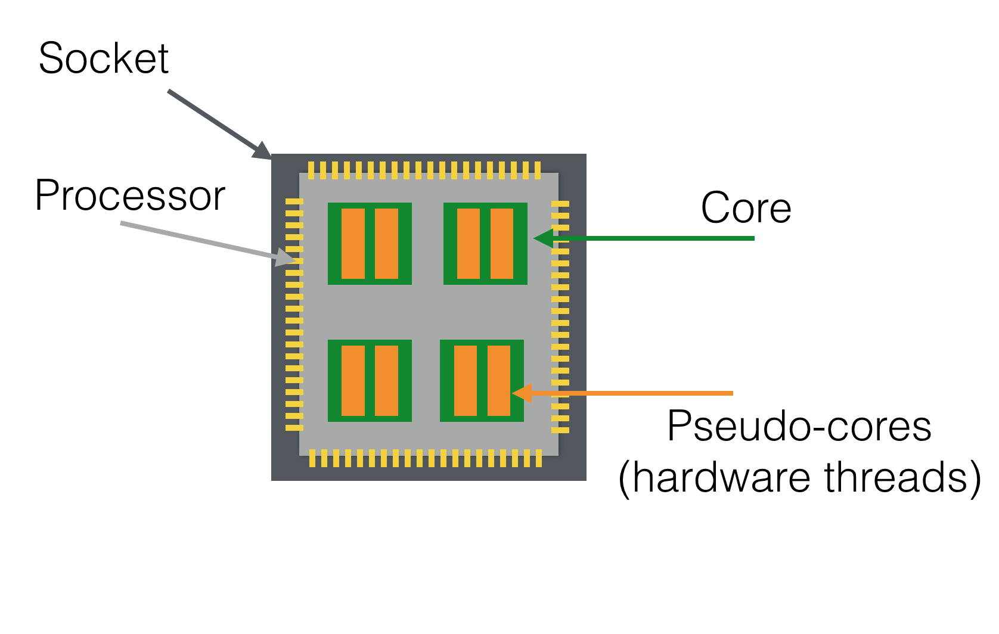
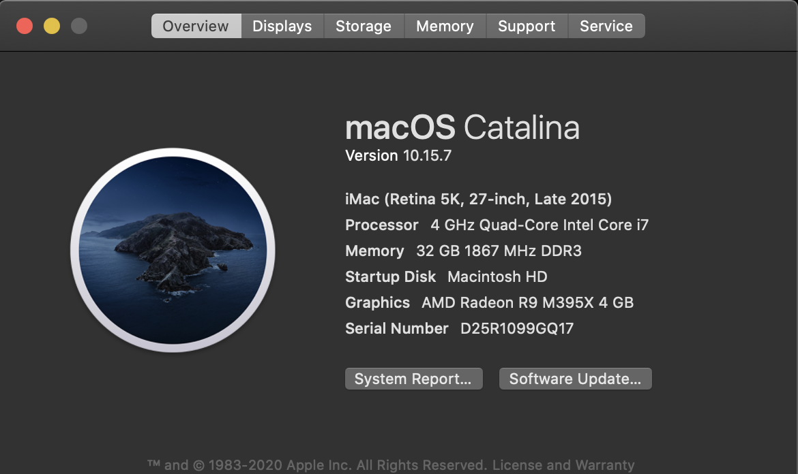
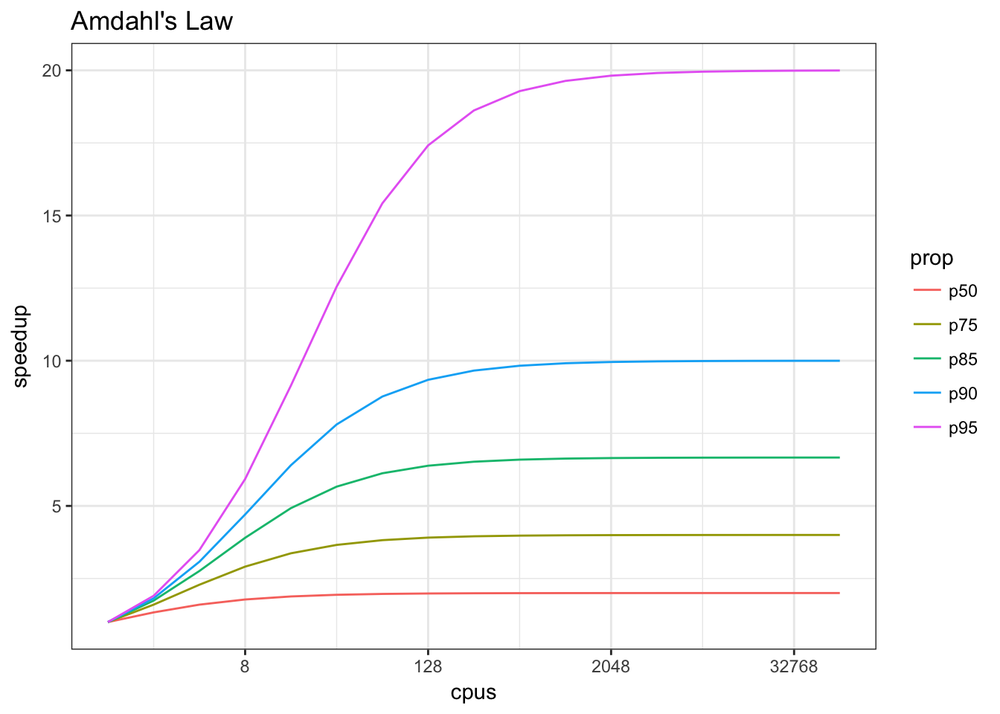
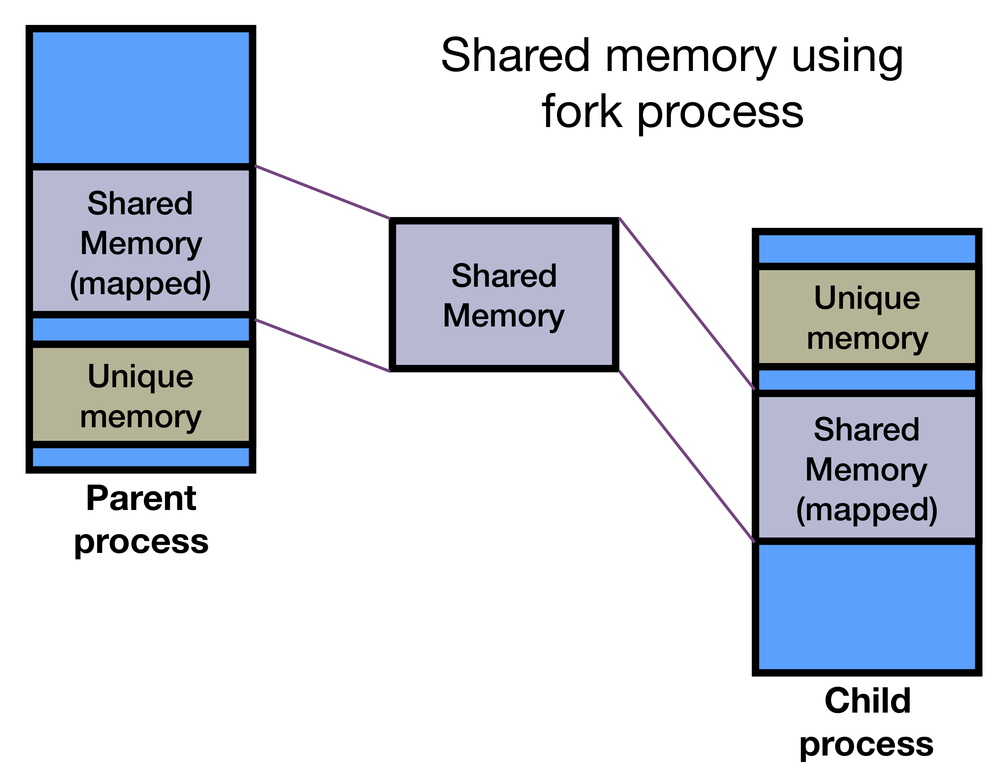
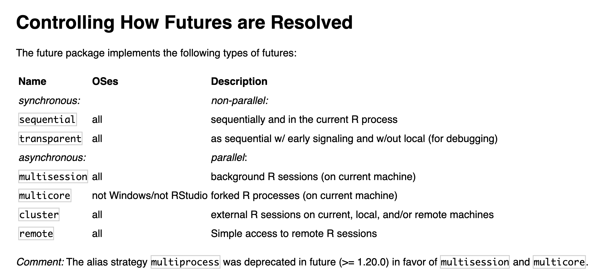

# Follow along here

https://github.com/erichare/parallel_presentation

---
class: inverse, center, middle

# A Primer on Modern CPU Processing

---

## Computer Processors

Your processor, or CPU, executes the instructions needed by the applications (and operating system) of your machine.

- Web browsing
- R code execution
- Emails
- And of course your R code!

```{r}
rnorm(5)
```

---

## Processor Diagram

```{r, echo=FALSE}

```

---

## Why should I care?

```{r}
library(parallel)

detectCores()
```

- Is this value anything above 1?
- Then you may be waiting too long for some of your scripts to run!

---

## Checking your System Info

```{r, echo=FALSE}

```

---

## Command Line Method

```{bash}
sysctl hw.ncpu hw.physicalcpu
```
---

## One Last Thing...

```{r, echo=FALSE}

```


---
class: inverse, center, middle

# Basic Parallel Processing in R

---

## Parallel Package

- The parallel package comes with a default R installation (no CRAN packages required)
- Provides (among other things) a parallel version of the `apply()` family of functions

```{r}
library(parallel)

?mclapply
```

---

## Two methods of parallelism

- *Core-based* parallelism - `mclapply` and `mcmapply`
- *Processer-based* parallelism - `parLapply`, `parApply`, ...

The latter form of parallelism is more complex:

1. It requires the creation of a `cluster` using the `makeCluster()` function
2. The clusters must be managed, and when necessary objects must be explicitly exported to the nodes of the cluster
3. This enables some interesting functinoality though, including taking advantage of parallelism across multiple computers on the same network!


**Important Caveat**: Because mclapply takes advantage of the `fork()` functionality provided by Unix systems, it does not work on Windows, so Windows users must use the `parLapply` series of functions.


---

## Forking with Shared Memory

```{r, echo=FALSE}

```

---

## mclapply Example

Standard non-parallel code:

```{r, message=FALSE}
library(zoo)

my_data <- replicate(50000, list(rnorm(24)))

do_some_fancy_work <- function(x) {
  return(rollmean(x, 10))
}

t1 <- Sys.time()

res <- lapply(my_data, do_some_fancy_work)

Sys.time() - t1
```

---

## mclapply Example

mclapply 

```{r}
t1 <- Sys.time()

res <- mclapply(my_data, do_some_fancy_work, mc.cores = detectCores() - 1)

Sys.time() - t1
```
---

## Why not just increase the number of mc.cores?

```{r}
t1 <- Sys.time()

res <- mclapply(my_data, do_some_fancy_work, mc.cores = 100)

Sys.time() - t1
```

---

## On Windows...

```{r}
t1 <- Sys.time()

res <- mclapply(my_data, do_some_fancy_work, mc.cores = 1)

Sys.time() - t1
```
---

## parLapply Example

```{r}
cl <- makeCluster(detectCores() - 1)
```

```{r, eval=FALSE}
res <- parLapply(cl, my_data, do_some_fancy_work) # Doesn't work!
```

Oops! Why won't this code work?

---

## Let's define the packages to load...

```{r, message=FALSE}
pkgs <- clusterEvalQ(cl, library(zoo))

t1 <- Sys.time()

res <- parLapply(cl, my_data, do_some_fancy_work) # Better!

Sys.time() - t1
```

---

class: inverse, center, middle

# Parallel Processing using `furrr`

---

## Why not use what we've previously talked about?

- If you have a loop or an lapply statement, I would tend to stick with the base parallel package.
- But for more complex data manipulations, especially in the `tidyverse` framework, shoe-horning in apply statements is not always straightforward

My favorite package for parallel computation when working within the tidyverse is `furrr`

```{r, echo=FALSE, fig.align="center"}

```
---

## `furrr` vs `purrr`

If you're familiar with `purrr`, you know that there's a set of `map_*()` functions that integrate nicely in a tidyverse pipeline. Furrr adds parallel support using the `future` package to these functions:

```{r, results='hide'}
library(purrr)
library(furrr)

map(1:5, function(x) x^2)
future_map(1:5, function(x) x^2)
```

Note: With no backend specified, `future_map` runs sequentially, NOT in parallel (for compatibility with purrr)

---

## One quick RStudio note

For MacOS and Linux users who want to use forking, the `future` package that `furrr` uses as a backend by default disables mutlicore support when running in RStudio:

```{r}
parallelly::supportsMulticore()
```

For forking, you can use the RStudio `jobs` feature:

https://github.com/HenrikBengtsson/future/issues/299

---

## Setting our backend

```{r}
availableWorkers()
plan(multisession)

t1 <- Sys.time()

res <- future_map(my_data, do_some_fancy_work)

Sys.time() - t1
```

---

## Other "plans"

https://cran.r-project.org/web/packages/future/vignettes/future-1-overview.html

```{r, echo=FALSE}

```

---

## Works great in a pipe!

```{r}
mtcars %>%
  split(.$cyl) %>%
  future_map(~lm(mpg ~ wt, data = .x))
```

---

class: inverse, center, middle

# Tracking Progress of your Workers

---

## Progress Bars

A recent development in the latest `furrr` release is integration with the `progressr` package to provide progress estimates for your jobs.

```{r}
t1 <- Sys.time()

res <- future_map(my_data, do_some_fancy_work, .progress = TRUE)

Sys.time() - t1
```

---

## We can do better than that...

```{r}
library(progressr)

do_some_fancy_work2 <- function(x, p) {
  p()
  return(rollmean(x, 10))
}

my_data <- replicate(n = 10000, runif(20), simplify = FALSE)

res <- with_progress({
    p <- progressor(steps = length(my_data))
    result <- future_map(my_data, do_some_fancy_work2, p=p)
})
```

---

class: inverse, center, middle

# Thank You

References:

- https://nceas.github.io/oss-lessons/parallel-computing-in-r/parallel-computing-in-r.html
- https://en.wikipedia.org/wiki/Amdahl%27s_law
- https://cran.r-project.org/web/packages/future/vignettes/future-1-overview.html
- https://cran.r-project.org/web/packages/progressr/vignettes/progressr-intro.html
